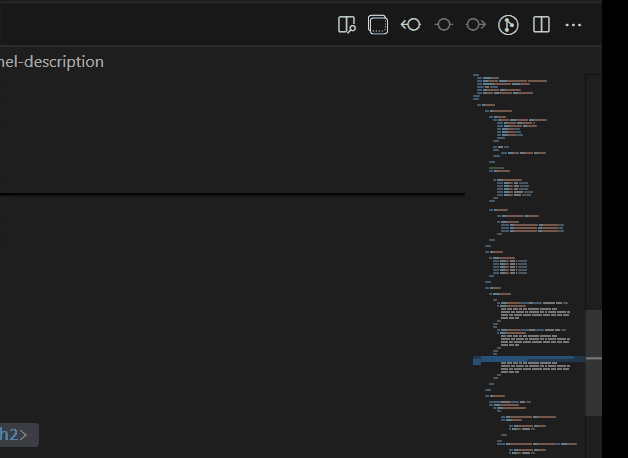
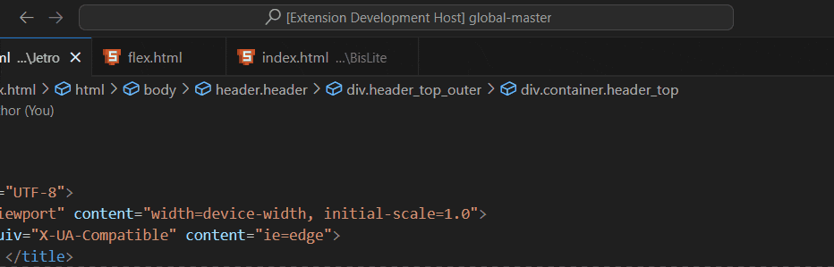
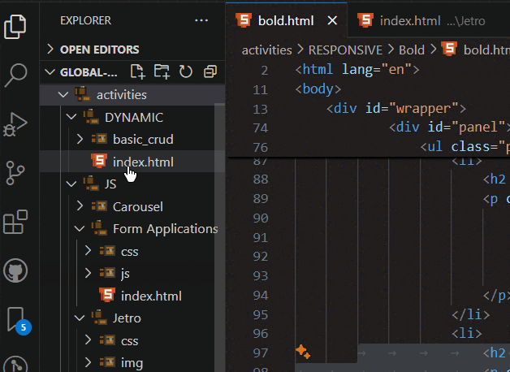
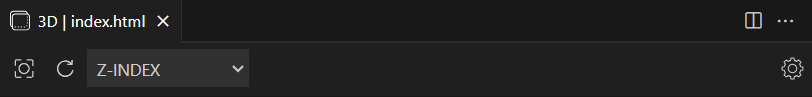
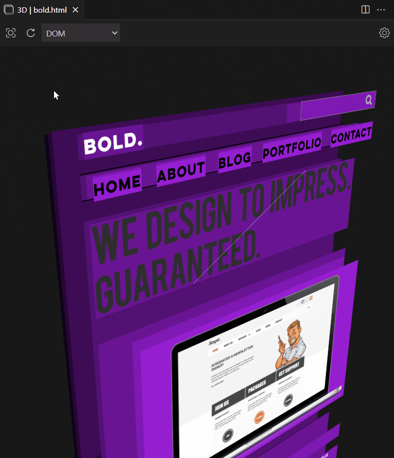
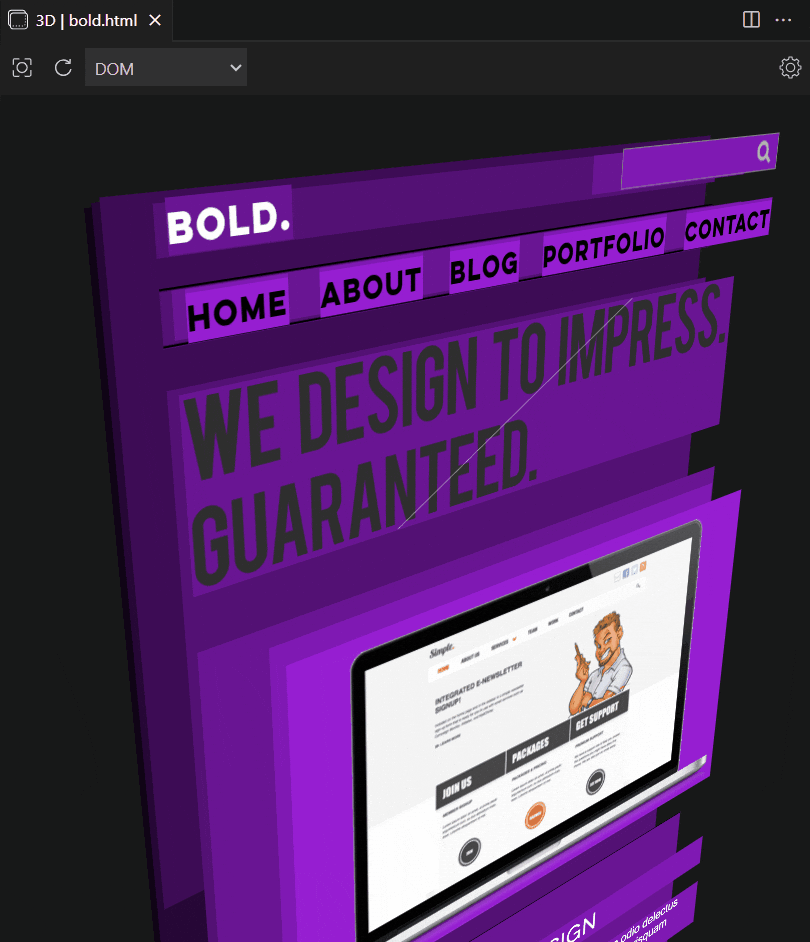
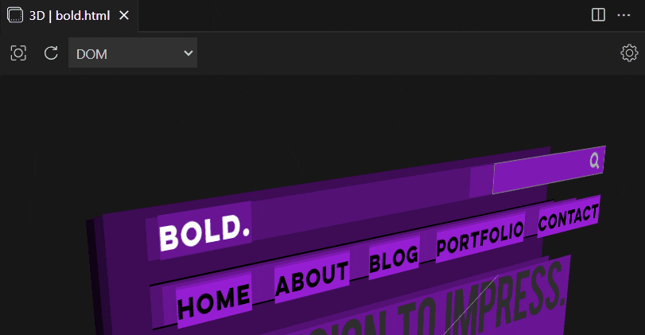
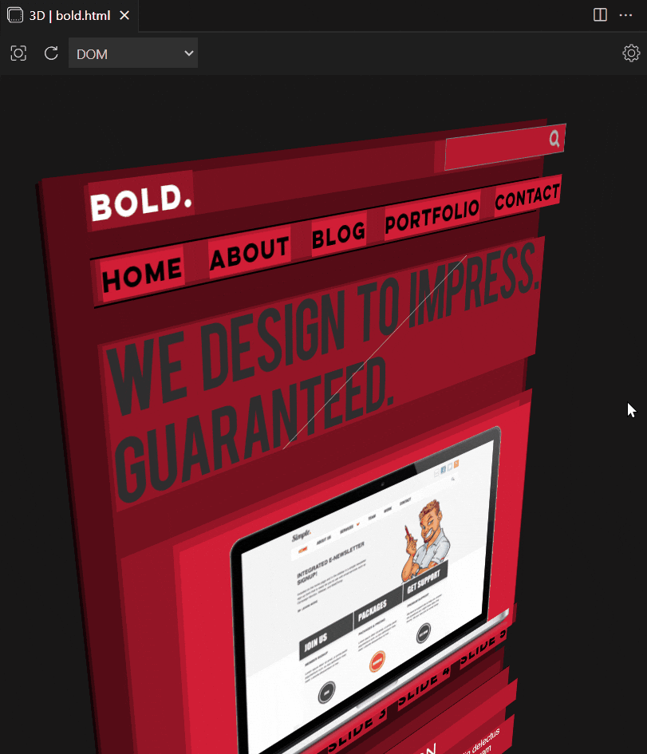
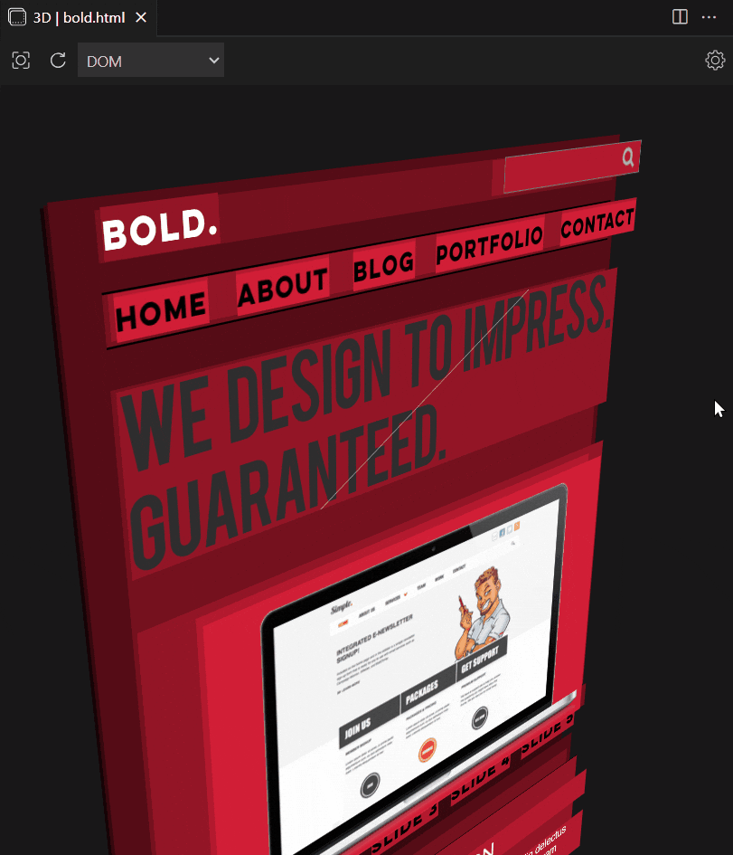
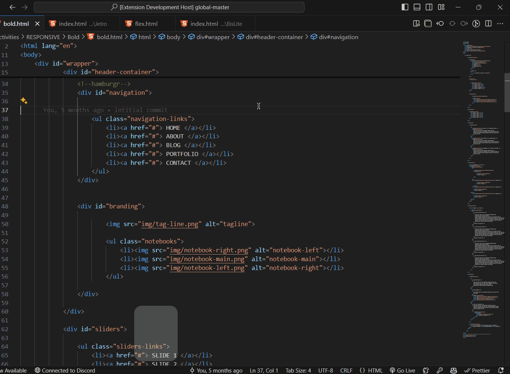

## How to start 3D HTML Viewer?
( NOTE: this only works if your active editor is an html file )
- **use shortcut**: just use the shortcut `Ctrl/Cmd(⌘)` + `Shift` + `3` 

- **editor button**: while your editor has an opened html, you can click on the dedicated button

- **command palette**: press `F1` type `3D HTML VIEWER` or `View HTML in 3D` and hit enter

- **context menu**:  right-click any html file and choose `View HTML in 3D`

## Toolbar controls

- **recenter**: recenters the camera

- **refresh**: reloads the page (also makes any changes in position return to default)

- **mode**: changes how elements are stacked

- **settings**: different settings to change on how elements are rendered

| **Setting**                         | **Type**  | **Default** | **Values/Range**      | **Description**                                             |
|-------------------------------------|-----------|-------------|-----------------------|-------------------------------------------------------------|
| **Mode (`3dhtmlviewer.mode`)**       | `string`  | `DOM`       | `DOM`, `Z-INDEX`, `BOTH` | Sets the default mode for the stack constructor.            |
| **Zoom Level (`3dhtmlviewer.zoom`)** | `number`  | `0.8`       | `0.1` to `2`          | Sets the default zoom level of the camera.                  |
| **Color the Layers (`3dhtmlviewer.colorTheLayers`)** | `boolean` | `true` | N/A | Enables or disables coloring the layers.                    |
| **Randomize Colors (`3dhtmlviewer.colorRandom`)** | `boolean` | `false` | N/A | Colors the layers randomly when enabled.                    |
| **Hue (`3dhtmlviewer.hue`)**         | `number`  | `0`         | `0` to `360`          | Sets the default hue value of the layers.                   |
| **Gap Between Layers (`3dhtmlviewer.gap`)** | `number` | `20` | `0` to `100` | Controls the gap distance between layers.                   |

## Controls/Movement

- **Left click drag**: rotate

- **Right click drag**: translate/dragging (also repositions the rotation center)

- **Scrollwheel**: scrolls the page

- **Alt + Scrollwheel**: zooms the camera

- **Hover on an Element**: shows info about the element

## Change default settings

changing default settings on the renderer is easy, just press `F1` search for `Preferences: Open Settings (UI)` and search for `3D HTML Viewer`

