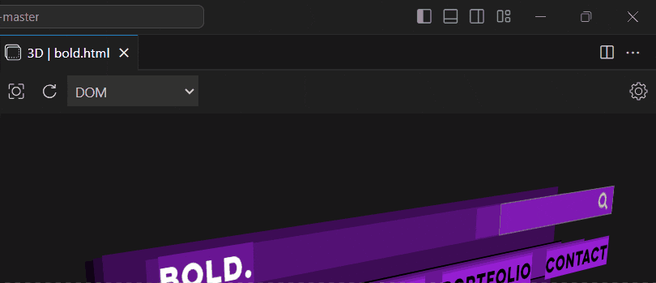
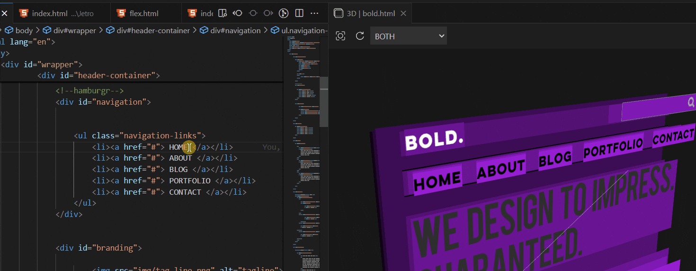

# 3D HTML Viewer

A Visual Studio Code extension that allows you to debug your HTML files in a 3D perspective. Perfect for visualizing the structure of your HTML documents and exploring the spatial relationships between elements.

## Features

- **3D Visualization:** View your HTML documents in a 3D space.
- **Custom Stacking:** Render stack of elements by `DOM`, `Z-INDEX` or `BOTH`

- **Reload on Save:** Any saved changes will automatically be reflected in the renderer 

- **Quick HTML Change:** Changes rendered HTML based on which editor is active (as long as its a valid HTML)

- **View Element Details** View information about the element's position, size, layer, etc. 

## Installation

To install the **3D HTML Viewer** extension, follow these steps:

1. Open Visual Studio Code.
2. Go to the Extensions view by clicking on the Extensions icon in the Activity Bar.
3. Search for "3D HTML Viewer" by Aizhe.
4. Click **Install**.

## Usage

1. Open an HTML file in VS Code.
2. Press `Ctrl+Shift+3` (Windows/Linux) or `Cmd(⌘)+Shift+3` (Mac) to activate the 3D viewer.
3. Customize the view using the available settings.

For more info you can read the [guide](GETTINGSTARTED.md)

## Contributing

If you encounter any issues or have suggestions for improvements, please visit the [GitHub repository](https://github.com/Aizhee/3d-html-viewer) and submit an issue or pull request.

## Changes

See changelog [here](CHANGELOG.md)

## License

Uses GPL-3.0 Licensed code from [dom3d.js](https://github.com/OrionReed/dom3d) by OrionReed which this project is based on. 

[GPL-3.0](LICENSE.md) © Aizhe 2024

---

